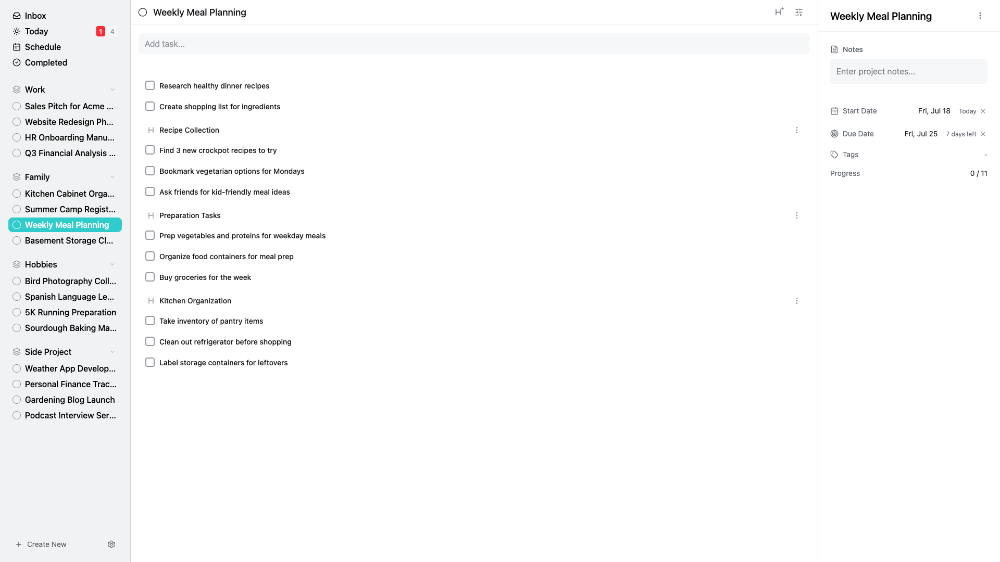

# HamsterBase Tasks

A local-first and privacy first task manager. It is designed to be simple and easy to use.

## Online Demo

[Web version](https://tasks-app.hamsterbase.com/)

## Features

- **No Spinners: Instant Access** - HamsterBase Tasks ensures data is stored on your device, letting you work immediately without waiting for server responses.

- **Multi-Device Sync: Access Anywhere** - It syncs your data across devices like phones and laptops, so your work is available everywhere.

- **Offline Ready: Network Optional** - You can use the app offline, with data stored locally and syncing later when connected, perfect for areas with poor internet.

- **Long-Term Access: Data Lasts** - Ensures your data remains accessible over time by using durable formats and running on local devices indefinitely.

- **Privacy First: Secure by Default** - End-to-end encryption ensures your data remains private. Even developers cannot access your decrypted data.

- **Full Control: You Own Your Data** - You have complete control over your data, stored on your device, allowing free backups and modifications without restrictions.

- **Open Source: Community Driven** - HamsterBase Tasks is open source, allowing the community to contribute, inspect, and improve the codebase, ensuring transparency and continuous development.

## Download

To download the latest version of HamsterBase Tasks, visit the [official page](https://tasks.hamsterbase.com/).

## Contributing

We welcome contributions! Please see our [Contributing Guide](CONTRIBUTING.md) for details on how to get started.

## Build Instructions

### Android

To build the Android application from source, see detailed instructions in [docs/android-build-instructions.md](docs/android-build-instructions.md).

## License

This project is licensed under the GNU Affero General Public License v3.0 - see the [LICENSE](LICENSE) file for details.

### Third-party

- **Vite Plugin Istanbul:** Code under packages/vite-plugin-istanbul is licensed under the MIT License. See the [LICENSE](src/packages/vite-plugin-istanbul/license) file for details.
- **VSCF:** Code Under packages/vscf is licensed under the MIT License. See the [LICENSE](src/packages/vscf/License) file for details.
